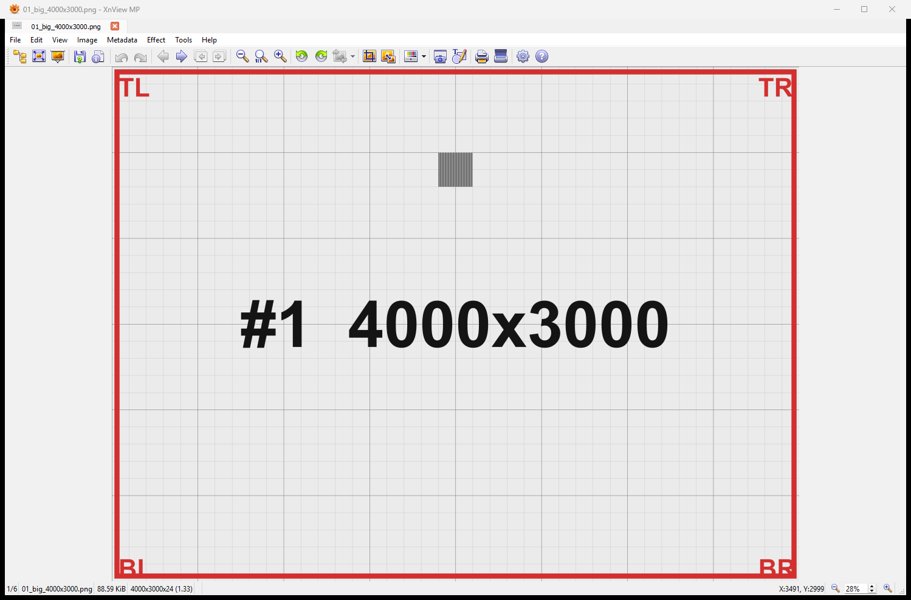
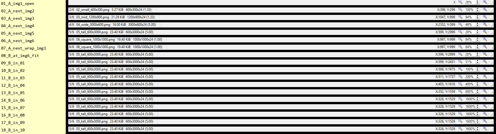
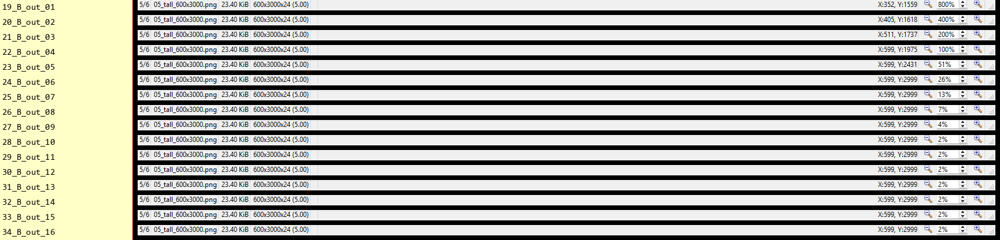
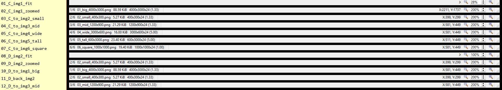
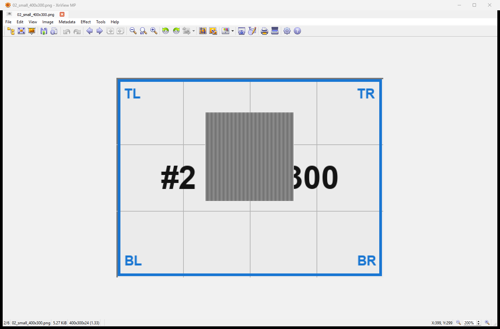
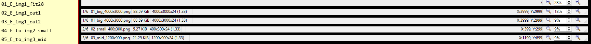
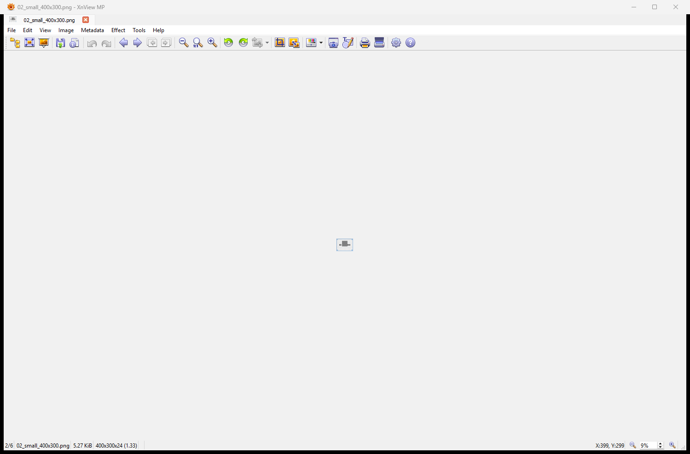

# XnView MP — zoom & scale-on-navigation behavior (empirical study)

Reference notes captured to inform vgiew's "keep zoom when browsing" design and a
possible revision of [ADR 0004](../../adr/0004-open-scale-window-size-and-zoom-centering.md)
(which currently floors zoom at shrink-to-fit and rejects sub-fit zoom).

- **Subject:** XnView MP 1.11.2 (x64)
- **Host:** Windows 11, single 2560×1440 monitor; XnView window ~1499×989
- **Date:** 2026-07-09
- **Method:** 6 synthetic labeled PNGs of differing dimensions were opened as a
  folder. XnView was driven headlessly with `PostMessage(WM_KEYDOWN/UP)` (navigation
  and zoom keys) and captured with `PrintWindow(PW_RENDERFULLCONTENT)` — neither
  needs foreground focus. Zoom % and image index were read from XnView's status bar.

## TL;DR

1. **Sub-100% / sub-fit zoom is fully supported.** Zoom-out floor is an *absolute*
   ~1–2%, **not** the fit scale. A small image can be shrunk to a tiny centered dot.
2. **Zoom ceiling ≈ 1600%.** Keyboard `+`/`-` steps in a ~×2 ladder
   (…50/100/200/400/800/1600); the mouse wheel uses ×√2 (`zoomRelative=1.41421356`).
3. **Scale on navigation is governed by a mode, exactly like a `fit_mode` flag:**
   - **At fit** (on-open / reset state): browsing **re-fits each image** to its own
     fit%.
   - **After any manual zoom:** the **literal zoom %** is locked and carried
     verbatim to every subsequently browsed image — *regardless of the new image's
     size, and even when that % is far below the new image's fit* (a small image is
     then shown as a tiny dot). It is **not** fit-relative and **not** clamped to fit.
4. When a carried zoom makes the image smaller than the viewport, it is **centered**.
5. **No wrap-around** at the folder ends (Page Down on the last image stays put).

The net model is: *a fit flag + a literal carried scale, with an absolute zoom floor.*

## Relevant config (`%APPDATA%\XnViewMP\xnview.ini`, `[Viewer]`)

```
lockZoom=true          # "keep zoom on image change" — ON
lockZoomFlag=true
resetFit=true
fit=1
zoomRelative=1.41421356   # mouse-wheel zoom step = √2
zoomFixed=10
outZoomFilter=0           # resample filter when minified
inZoomFilter=-1           # resample filter when magnified (default)
```

`lockZoom=true` is what makes the manual-zoom % persist across navigation; with it
off, XnView refits every image (behaviour not captured here).

## Test images and their fit %

| # | file | pixels | fit % (this window) |
|---|------|--------|---------------------|
| 1 | big     | 4000×3000 | 28% |
| 2 | small   | 400×300   | 100% (capped; native is smaller than window) |
| 3 | mid     | 1200×900  | 94% |
| 4 | wide    | 3000×600  | 49% |
| 5 | tall    | 600×3000  | 28% |
| 6 | square  | 1000×1000 | 84% |

Open state, image #1 at its 28% fit (note the `1/6` index and `28%` at the status
bar edges — the readouts used throughout):



## Part A — navigation while at fit

Opened #1 (never manually zoomed) and pressed Next through the folder. Each image
is refit to **its own** fit %:

| step | image | zoom shown |
|------|-------|-----------|
| open #1 | big 4000×3000 | 28% |
| →#2 | small 400×300 | 100% |
| →#3 | mid 1200×900 | 94% |
| →#4 | wide 3000×600 | 49% |
| →#5 | tall 600×3000 | 28% |
| →#6 | square 1000×1000 | 84% |
| →Next | (stays 6/6) | 84% — **no wrap** |

So "fit" behaves as a *mode* carried across images, not a locked number.

## Part B — zoom range on one image (keyboard `+`/`-`)

Zoom in from fit, then out to the floor (image #5, tall):

```
in:   28 → 51 → 100 → 200 → 400 → 800 → 1600 (ceiling; further + does nothing)
out: 1600 → 800 → 400 → 200 → 100 → 51 → 26 → 13 → 7 → 4 → 2 (floor; further - does nothing)
```

Ceiling **1600%**, floor **~2%** (an absolute minimum, unrelated to fit — the same
~2% floor was reached for both the 400×300 and 600×3000 images). Status-bar trail:




## Parts C & D — carrying a manual zoom across navigation

**Part C:** zoom #1 (big) to **200%**, then browse forward. Every image shows 200%.
**Part D:** reverse — zoom #2 (small) to 200%, go to #1 (big): also 200%, and it
persists onward.

| step | image | zoom shown |
|------|-------|-----------|
| C: #1 zoomed | big | **200%** |
| C: →#2 | small | **200%** |
| C: →#3 | mid | **200%** |
| C: →#4 | wide | **200%** |
| C: →#5 | tall | **200%** |
| C: →#6 | square | **200%** |
| D: #2 zoomed | small | 200% |
| D: →#1 | big | **200%** (was 28% at fit) |
| D: →#2 | small | 200% |
| D: →#3 | mid | 200% |

Literal, not fit-relative (fit-relative would have shown ~700% on #2), not reset.



Carrying 200% onto the small 400×300 image → 800×600, **centered** in the viewport:



## Part E — carrying a *sub-fit* zoom (the decisive case)

Zoom #1 (big) **out** to 9% (below the small image's 100% fit), then browse:

| step | image | zoom shown |
|------|-------|-----------|
| #1 fit | big | 28% |
| #1 zoom out | big | 18% |
| #1 zoom out | big | 9% |
| →#2 | small 400×300 | **9%** |
| →#3 | mid 1200×900 | **9%** |

The small image is shown at a literal **9%** — a ~36×27 px dot centered in the
window — **not** snapped up to its 100% fit:




This is the "tiny floating image" ADR 0004 dismissed as having "no purpose"; XnView
produces it deliberately, as the natural consequence of a pure literal-zoom lock.

## Implications for vgiew

- **Concrete precedent against ADR 0004's sub-fit rejection.** A mainstream viewer
  (the same one 0004 surveyed) allows zoom well below fit, down to ~1%. That
  weakens "leaves a tiny floating image with no purpose" as a blanket argument.
- **XnView's model == the model already proposed for vgiew:** a fit flag plus a
  carried *literal* scale. The difference that makes it clean is the **absolute**
  zoom floor (~1%) instead of vgiew's current per-image `view_fit` floor. With an
  absolute floor, literal scale-preservation needs **no snap-to-fit** — the awkward
  big→small case just shows the small image tiny, which is what XnView does.
- **Cost XnView accepts:** browsing after a strong zoom-out can render a small image
  as a dot. Reset-to-fit (our `0` key) is the escape hatch.

### Points where vgiew currently differs (decide explicitly)

| aspect | vgiew today | XnView MP |
|--------|-------------|-----------|
| zoom-out floor | `view_fit` (never below fit) | absolute ~1% |
| browse at fit | refit each (same) | refit each (same) |
| browse after zoom | resets to fit | keeps literal % |
| wrap-around at ends | yes | no |
| wheel zoom step | ×1.25 | ×√2 |
| max zoom | 64× (6400%) | 16× (1600%) |
